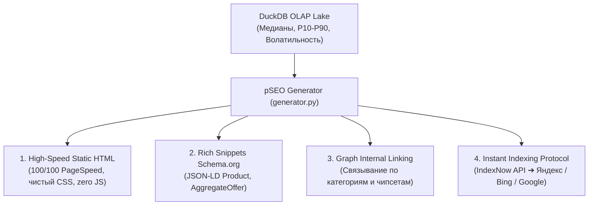

# Skill: agentic-pseo (Programmatic SEO & Search Engine Distribution Engine)

## 🎯 Назначение
Этот навык регламентирует методы программной генерации тысяч статических страниц на основе числовых данных из DuckDB Data Lake, их мгновенной индексации в Яндексе/Google через протокол IndexNow и монетизации через CPA-партнерки маркетплейсов.

---

## 🏛️ Архитектурные компоненты и стандарты



---

## ⚡ 1. Стандарт генерации страниц (100/100 PageSpeed & Zero AI-Slop)

1. **Запрет на тяжелые фреймворки и клиентский JS:**
   * Все страницы генерируются как чистый статический HTML + инлайновый CSS.
   * Время первой отрисовки (FCP) $\le 30$ миллисекунд.
2. **Векторные SVG-графики (Zero External Libraries):**
   * График котировок, коридор справедливой цены (P25–P75) и ценовые уровни рендерятся как чистые `<svg>` элементы прямо в HTML.
3. **Статистическая фильтрация шума (IQR Trimming):**
   * Всегда отсекать аномалии $< \text{Median} \times 0.35$ (коробки, кабели) и $> \text{Median} \times 2.3$.
   * Расчет квантилей: P10 (Зона выкупа), P25, P50 (Медиана), P75, P90.

---

## 🚀 2. Протокол мгновенной индексации (IndexNow Protocol)

Вместо пассивного ожидания поисковых роботов, система отправляет сигнал краулерам сразу после генерации:

```python
import urllib.request
import json

def submit_to_indexnow(host: str, key: str, url_list: list):
    """Мгновенная отправка URL в поисковики (Яндекс, Bing, Seznam)"""
    endpoint = "https://api.indexnow.org/indexnow"
    payload = {
        "host": host,
        "key": key,
        "keyLocation": f"https://{host}/{key}.txt",
        "urlList": url_list[:10000]
    }
    req = urllib.request.Request(
        endpoint,
        data=json.dumps(payload).encode('utf-8'),
        headers={'Content-Type': 'application/json; charset=utf-8'}
    )
    with urllib.request.urlopen(req, timeout=10) as resp:
        return resp.status == 200
```

---

## 🔗 3. Графовая перелинковка (Graph Internal Linking)

Для передачи ссылочного веса (PageRank) и предотвращения страниц-сирот (orphan pages):
* Каждая страница обязана содержать блок **«Связанные комплектующие»** (3 ссылки вверх/вниз по линейке: `RTX 3070` ➔ `RTX 3080` ➔ `RTX 3090`).
* Автоматическая генерация хлебных крошек (`BreadcrumbList` в JSON-LD).

---

## 🛡️ 4. Quality Gates (Защита от санкций за дубли и thin content)

Перед публикацией страницы проверяются по чек-листу:
- [ ] В базе DuckDB для этого товара есть $\ge 3$ реальных валидных объявлений?
- [ ] Отрисован ли интерактивный график цен (SVG)?
- [ ] Присутствует ли таблица аппаратных спецификаций и инженерный чек-лист проверки?
- [ ] Если данных недостаточно — страница помечается тегом `<meta name="robots" content="noindex, follow">`.
