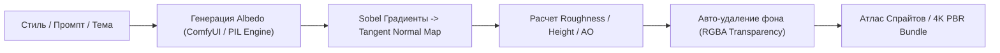

# Skill: ai-asset-factory (Автономный конвейер производства AI-ассетов)

## 🎯 Назначение
Этот навык регламентирует процессы автономной генерации, верификации качества и компиляции цифровых ассетов для инди-игр, моддинга и маркетплейсов с нулевой себестоимостью (0 ₽).

---

## 🏛️ Архитектура конвейера (Production Pipeline)



---

## 🛠️ 1. Стандарты генерации ассетов

### А. PBR Текстуры (2K / 4K Seamless):
1. **Карта нормалей (Tangent-Space Normal):**
   * Вычисляется через градиенты Собеля по формуле:
     $$dx = (z_{x+1, y} - z_{x-1, y}) \cdot \text{strength}, \quad dy = (z_{x, y+1} - z_{x, y-1}) \cdot \text{strength}$$
     $$\vec{N} = \text{normalize}(-dx, -dy, 1.0) \to [R, G, B]$$
   * Формат: OpenGL (зеленый канал Y-up) с возможностью инверсии для DirectX.
2. **Карта шероховатости (Roughness):**
   * Нормализованное распределение контраста с отсечением выбросов (2-й и 98-й перцентили).
3. **Ambient Occlusion (Кавитационная карта):**
   * Разностный фильтр Гаусса ($Height - BlurredHeight$) для подчеркивания трещин и стыков.

### Б. Иконки и Спрайты Предметов (RPG Icons):
1. **Изоляция фона:**
   * Строгий прозрачный альфа-канал (`RGBA`), отсутствие цветового шума по краям.
2. **Стилевое единообразие:**
   * Одинаковый угол освещения (верхний левый источник света), единая цветовая палитра и контурная обводка.
3. **Компиляция в атлас:**
   * Автоматическая сборка в сетку (4x4, 8x8) для мгновенного импорта в Unity / Unreal Engine / Godot.

---

## ⚡ 2. Команды автономного запуска (CLI)

```powershell
# Генерация 10 PBR материалов нужного стиля
python scripts/rmon.py assets textures --style scifi_metal --count 10 --res 1024

# Генерация 20 RPG зелий и артефактов
python scripts/rmon.py assets icons --item-type potion --count 20 --res 512

# Сборка и проверка ComfyUI портативного пака
python scripts/rmon.py comfyui build
```

---

## 📋 Чек-лист контроля качества перед релизом
- [ ] Бесшовность текстур проверена (отсутствие артефактов на границах).
- [ ] Карта нормалей имеет сине-фиолетовый базовый тон `(128, 128, 255)`.
- [ ] Прозрачность иконок чистая (0% альфа на фоне, без паразитных пикселей).
- [ ] Разрешение файлов кратно степени двойки (512, 1024, 2048, 4096).
