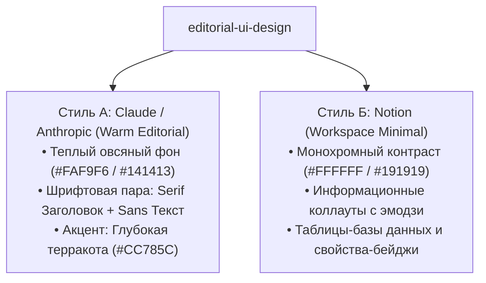

# Skill: editorial-ui-design (Claude & Notion UI Design System)

## 🎯 Назначение
Этот навык регламентирует создание премиальных, спокойных и визуально дорогих веб-страниц, отчетов и интерфейсов, вдохновленных эстетикой **Anthropic Claude (Warm Editorial)** и **Notion (Minimal Workspace)**. Навык полностью устраняет «нейрослоп» (дешевые градиенты, пластиковые кнопки, кричащий неон).

---

## 🎨 1. Две ключевые эстетические семьи (Aesthetic Families)



---

## 🏛️ 2. Палитры и дизайн-токены (Design Tokens)

### Семья 1: Claude Editorial (Теплый, интеллектуальный, книжный)
```css
:root {
  /* Светлая тема (Warm Ivory) */
  --claude-bg: #FAF9F6;
  --claude-surface: #F3F1EB;
  --claude-border: #E5E2DA;
  --claude-text-main: #141413;
  --claude-text-muted: #6B6862;
  --claude-accent: #CC785C; /* Фирменная терракота Claude */
  --claude-accent-soft: rgba(204, 120, 92, 0.12);

  /* Темная тема (Dark Charcoal & Warm Slate) */
  --claude-dark-bg: #141413;
  --claude-dark-surface: #1E1E1C;
  --claude-dark-border: #2C2C29;
  --claude-dark-text-main: #F3F1EB;
  --claude-dark-text-muted: #9C9A93;
}
```

### Семья 2: Notion Minimalist (Чистый, функциональный, модульный)
```css
:root {
  /* Notion Light */
  --notion-bg: #FFFFFF;
  --notion-subtle: #F7F6F3;
  --notion-border: #EBEAEA;
  --notion-text: #37352F;
  --notion-text-light: #787774;

  /* Notion Callout Colors */
  --callout-blue-bg: #F0F5FF;
  --callout-blue-border: #D0E1FD;
  --callout-amber-bg: #FEF7EC;
  --callout-amber-border: #FBE2B5;
}
```

---

## ✍️ 3. Типографика (Typography Rules)

1. **Книжные заголовки (Editorial Serifs):**
   * Для H1/H2 в стиле Claude используется благородный антиквенный шрифт:  
     `font-family: 'Newsreader', 'Iowan Old Style', 'Playfair Display', Georgia, serif;`
   * Начертание: Regular или Medium (`font-weight: 400–500`), отрицательный кернинг (`letter-spacing: -0.02em`).
2. **Текст и интерфейс (Modern Sans & Monospace):**
   * Для основного текста и интерфейса:  
     `font-family: -apple-system, BlinkMacSystemFont, 'Inter', 'Geist', sans-serif;`
   * Для числовых данных, тегов и котировок:  
     `font-family: 'JetBrains Mono', 'SF Mono', Menlo, monospace;`

---

## 🛡️ 4. Anti-Slop Kit: Чек-лист запретов

- ❌ **Никаких неоновых градиентов:** Запрещены фиолетово-розовые размытия, светящиеся рамки и неоновые тени.
- ❌ **Никаких гигантских скруглений:** Скругления карточек строгие и аккуратные (`border-radius: 6px–10px`).
- ❌ **Никакого низкого контраста:** Серый текст на темном фоне обязан иметь контрастность не менее $4.5:1$ (WCAG AA).
- ❌ **Никаких пластиковых 3D-кнопок:** Кнопки плоские, матовые, с тонкой волосяной рамкой (`1px solid`).

---

## 📋 5. Готовые компоненты в стиле Claude & Notion

### Коллаут в стиле Notion (Notion Callout Box):
```html
<div style="background: #F7F6F3; border: 1px solid #EBEAEA; border-radius: 6px; padding: 14px 18px; display: flex; gap: 12px; align-items: flex-start; margin: 20px 0;">
  <span style="font-size: 18px; line-height: 1.2;">💡</span>
  <div style="font-size: 14px; color: #37352F; line-height: 1.5;">
    <strong>Справедливая оценка:</strong> Медиана рынка рассчитана на основе 25 реальных лотов без учета аксессуаров.
  </div>
</div>
```

### Бейдж свойства (Notion Property Badge):
```html
<span style="display: inline-flex; align-items: center; background: rgba(204, 120, 92, 0.12); color: #CC785C; padding: 3px 8px; border-radius: 4px; font-size: 12px; font-weight: 600; font-family: monospace;">
  GDDR6X • 320-BIT
</span>
```

### Карточка в стиле Claude (Warm Surface Card):
```html
<div style="background: #1E1E1C; border: 1px solid #2C2C29; border-radius: 8px; padding: 22px; margin-bottom: 16px;">
  <h3 style="font-family: Georgia, serif; font-size: 18px; font-weight: 400; color: #F3F1EB; margin-bottom: 8px;">
    Инженерный протокол стресс-теста
  </h3>
  <p style="font-size: 14px; color: #9C9A93; line-height: 1.6;">
    Тестирование видеопамяти под нагрузкой FurMark с контролем температуры термопрокладок через HWiNFO64.
  </p>
</div>
```
