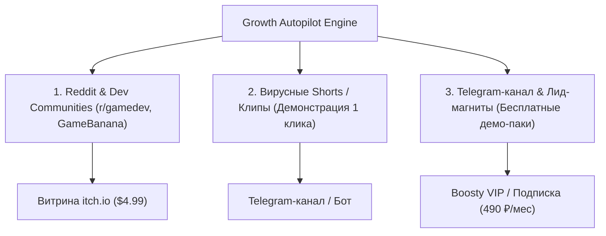

# Skill: growth-autopilot (Автономный маркетинг и вирусный трафик 0 ₽)

## 🎯 Назначение
Этот навык регламентирует генерацию высококонверсионного контента, дистрибуцию лид-магнитов и привлечение целевого трафика на цифровые витрины без платной рекламы.

---

## 🏛️ 3 Канала органического трафика



---

## ⚡ 1. Стандарты копирайтинга (Anti-Slop Standard)

* **Запрещен «маркетинговый мусор»:** Никаких фраз вроде *«Погрузитесь в уникальный мир невероятных текстур»*.
* **Только факты и польза (Engineering Direct):**
  * *«100 бесшовных 4K PBR текстур (Albedo, Normal, Roughness, AO) для Unreal Engine 5 и Unity. Лицензия CC-BY / Commercial. Скачать бесплатный пак из 5 штук: [ссылка]»*.
* **Наглядная демонстрация:** Каждый пост сопровождается GIF-анимацией или видео «ДО и ПОСЛЕ» применения карты нормалей / работы воркфлоу.

---

## 📝 2. Шаблон шоукейса для Reddit (`r/gamedev`, `r/IndieDev`)

```markdown
**[FREE ASSET PACK] 50 Seamless 4K PBR Materials for your indie project (Commercial use OK)**

Hey devs! Made a procedural material generator using local AI and baked a clean pack of 50 seamless materials:
- Resolution: 2048x2048 & 4096x4096 Lossless PNG
- Maps included: Albedo, Normal (OpenGL), Roughness, Height, Cavity AO
- Works with: Unreal Engine 5, Unity, Godot, Blender

👉 Download free 10-material demo on itch.io: [Link]
Full pack available for $4.99 to support my hardware cluster running 24/7!
```

---

## 🎬 3. Шаблон вирусного Shorts-сценария (Retention Hook)
* **0–3 сек (Хук):** «Как создать текстуру для игры за 5 секунд вместо 3 часов в Substance Painter» (демонстрация клика в ComfyUI).
* **3–15 сек (Процесс):** Ускоренное видео генерации карты нормалей из промпта на RX 6800 XT / RTX 3050.
* **15–25 сек (Результат):** Наложение материала на 3D-сферу в Blender.
* **25–30 сек (CTA):** «Забирай сборку ComfyUI и 50 готовых текстур бесплатно в нашем Telegram-боте [ссылка в шапке]».
