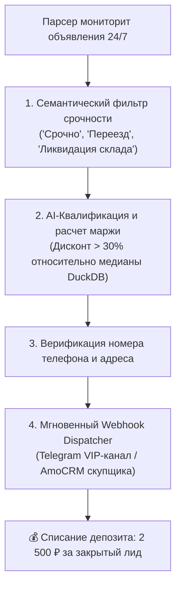

# Skill: leadgen-brokerage (B2B Арбитраж Лидов на Срочный Выкуп)

## 🎯 Назначение
Этот навык регламентирует методы превращения сырых данных маркетплейсов в квалифицированные B2B-лиды для профессиональных компаний (автовыкуп, скупка майнинг-ферм, торгового и ресторанного оборудования, электроники) с оплатой за каждый переданный контакт (от 2 000 до 5 000 ₽ / лид).

---

## 🏛️ Схема работы лидген-брокера (Lead Generation Flywheel)



---

## ⚡ 1. Семантические маркеры острой срочности (Urgency Trigger Matrix)

Парсер отслеживает текстовые маркеры в названии и описании:
* **Ликвидация бизнеса:** *«в связи с закрытием магазина/сервиса», «распродажа остатков», «отдам все разом оптом»*.
* **Срочная финансовая потребность:** *«срочно нужны деньги», «без торга за быструю оплату», «только сегодня»*.
* **Переезд и релокация:** *«в связи с переездом/релокацией», «заберите до пятницы»*.

---

## 📊 2. Структура карточки квалифицированного лида (Lead JSON Payload)

```json
{
  "lead_id": "LD-2026-8942",
  "category": "auto_commercial",
  "title": "Ликвидация склада: 4 комплекта шин R18 + диски",
  "seller_price": 45000,
  "market_median": 78000,
  "net_discount_rub": 33000,
  "discount_pct": 42.3,
  "urgency_score": 95,
  "seller_phone": "+79991234567",
  "location": "Москва, м. Юго-Западная",
  "lead_cost_rub": 2500,
  "direct_url": "https://avito.ru/..."
}
```

---

## 🚀 3. Webhook интеграция со скупщиками

```python
import urllib.request
import json

def dispatch_lead_to_buyer(webhook_url: str, lead_data: dict):
    """Мгновенная отправка лида в CRM или закрытый Telegram-чат скупщика"""
    req = urllib.request.Request(
        webhook_url,
        data=json.dumps(lead_data).encode('utf-8'),
        headers={'Content-Type': 'application/json'}
    )
    with urllib.request.urlopen(req, timeout=5) as resp:
        return resp.status in (200, 201)
```

---

## 📋 Чек-лист квалификации лида перед отправкой
- [ ] Дисконт лота к медиане рынка DuckDB составляет не менее **25%**?
- [ ] Описание проверено на отсутствие признаков скама (фейковые фото, заниженная цена за предоплату)?
- [ ] Номер телефона продавца верифицирован и доступен для звонка?
- [ ] Лид отправлен скупщику в течение **первой минуты** после появления в сети?
