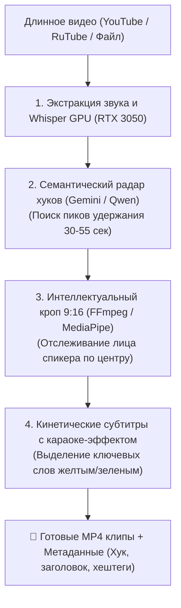

# Skill: viral-clip-factory (Автономная Видео-Фабрика Shorts & Клипов)

## 🎯 Назначение
Этот навык регламентирует методы превращения длинных видео, подкастов и лекций в высокоудерживающие вертикальные ролики (9:16) с субтитрами, используя вычислительные мощности мульти-хост кластера (RTX 3050 CUDA + RX 6800 XT).

---

## 🏛️ Архитектурный конвейер производства (Zero-Touch)



---

## ⚡ 1. Стандарты вирусного монтажа (Retention Optimization)

1. **Правило первых 3 секунд (The 3-Second Hook):**
   * Первые 3 секунды должны содержать шокирующий, противоречивый или высокоинсайтовый тезис спикера.
   * На экран сразу выводится крупный хук-заголовок (шрифт Montserrat / Impact, цвет `#FACC15`).
2. **Плотность субтитров (1–3 слова на экран):**
   * Длинные текстовые блоки запрещены (убивают динамику).
   * Субтитры меняются синхронно с речью со скоростью 150–250 мс на слово.
   * Ключевые эмоциональные слова автоматически выделяются контрастным цветом (`#10B981` зеленый, `#EF4444` красный).
3. **Формат и разрешение:**
   * Строго `1080x1920` (9:16), 30 или 60 FPS, кодек H.264 (NVENC hardware acceleration на RTX 3050).

---

## 🛠️ 2. Базовый шаблон FFmpeg аппаратного кропа и наложения субтитров

```bash
# Аппаратный рендеринг через NVENC на NVIDIA RTX 3050
ffmpeg -y -hwaccel cuda -i input.mp4 \
  -vf "crop=ih*(9/16):ih,scale=1080:1920,subtitles=styled_subs.ass:force_style='Fontname=Montserrat,Fontsize=18,PrimaryColour=&H00FFFFFF,BackColour=&H80000000,Bold=1'" \
  -c:v h264_nvenc -preset p4 -b:v 4500k \
  -c:a aac -b:a 192k \
  output_clip.mp4
```

---

## 💰 3. Воронка дистрибуции и монетизации (0 ₽ затрат на маркетинг)

* **Площадки загрузки:** YouTube Shorts, VK Клипы, Dzen, TikTok.
* **Перелив в актив:** В закрепленном комментарии и описании всегда дается ссылка на тематический Telegram-канал (например: *«Полный разбор и досье выложил в закреп нашего TG-канала [ссылка]»*).
* **Монетизация канала:** Продажа рекламных интеграций через Telega.in (от 1 500 до 5 000 ₽ за пост при 5 000+ подписчиков) + CPA партнерки образовательных платформ и софта.
