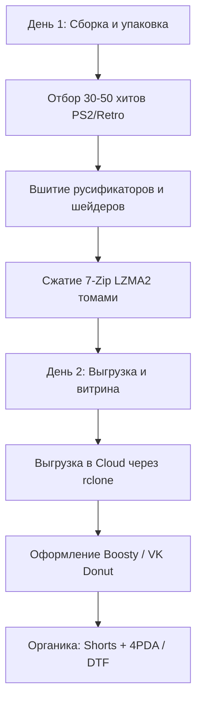

# Практические кейсы монетизации ресурсов и вычислительных мощностей
> **Профиль инфраструктуры:** 8 ТБ Cloud (Google Drive + Яндекс.Диск) | 1 Гбит/с канал 24/7 | Intel Core i5-12600KF (10c/16t) | 48 GB DDR4 RAM | AMD Radeon RX 6800 XT (16 GB VRAM) | 1.5 TB SSD  
> **Методология:** Lean Startup & Open Source First (0 ₽ стартовый бюджет, отсутствие платных API и подписок).  
> 🕒 **Дата актуальности среза данных:** Август 2026

---

## 📊 Сводная матрица кейсов (Валидировано на Август 2026)

| № | Направление / Кейс | AI-Автономия агента | Скорость запуска | Потенциал дохода (мес. 1) | Потенциал дохода (мес. 3–6) | Риск ToS (1–10) | Ключевой Open Source стек |
|---|---|:---:|:---:|:---:|:---:|:---:|---|
| **1** | **Plug-and-Play сборки эмуляторов** | **7.5 (75%)** | 1–3 дня | 5 000 – 18 000 ₽ | 40 000 – 120 000 ₽ | **3** | `Playnite`, `rclone`, `7-Zip`, `Skyscraper` |
| **2** | **Scraping & Monitoring 24/7** | **9.5 (95%)** 🏆 | 3–5 дней | 10 000 – 25 000 ₽ | 30 000 – 70 000 ₽ | **2** | `Playwright`, `DuckDB`, `Python`, `Task Scheduler` |
| **3** | **Пакетный AI-апскейлинг HD-текстур** | **8.8 (88%)** | 1–2 дня | 5 000 – 15 000 ₽ | 20 000 – 40 000 ₽ | **1** | `Real-ESRGAN-ncnn-vulkan`, `texconv`, `FFmpeg` |
| **4** | **Автономная витрина зеркал и модов** | **8.5 (85%)** | 3–4 дня | 3 000 – 10 000 ₽ | 25 000 – 50 000 ₽ | **2** | `aiogram 3.x`, `feedparser`, `Pillow`, `rclone` |
| **5** | **VOD-Vault (Архивация стримов)** | **9.0 (90%)** | 2–3 дня | 6 000 – 16 000 ₽ | 20 000 – 45 000 ₽ | **1** | `yt-dlp`, `FFmpeg (AMF)`, `rclone crypt` |

---

## 🎮 Кейс 1: Готовые Plug-and-Play сборки эмуляторов и игр под ключ

### 1. Суть продукта
Создание готовых портативных коллекций игр (Playnite / Batocera / RetroArch / Mod Organizer 2), в которых:
* Вшиты и проверены лучшие фанатские переводы и русификаторы (Kudos, R.G. Мегаперевод, Paradox, Exclusive, переводы Zone of Games).
* Настроены шейдеры (CRT, 4K resolution scaler, 60 FPS patches).
* Скачан полный арт-пак: обложки, описания, видеопревью и логотипы.
* Оптимизированы профили управления под геймпады (Xbox, DualSense, Steam Deck, ROG Ally).
* Сборка работает по принципу «скачал, распаковал, играешь».

### 2. Кто платит и реальная боль ЦА
* **Аудитория:** Владельцы портативных консолей (Steam Deck, ROG Ally, Lenovo Legion Go, Anbernic, Retroid Pocket) и ПК-геймеры 25–40 лет.
* **Боль:** У людей есть деньги, но катастрофически нет времени. Ручная настройка 100 игр на эмуляторах PS1/PS2/GameCube/Switch занимает 30–50 часов (поиск BIOS, подбор плагинов, ручная накатка русификаторов, маппинг кнопок).
* **Триггер покупки:** Быстрое скачивание 100–200 ГБ архива на максимальной скорости твоего облака (50–100 МБ/с) без обрывов и «умерших» ссылок.

### 3. Доказательная база и подтвержденные метрики (Август 2026)
* **Поисковый спрос (Яндекс Wordstat):**
  * `эмулятор ps2 на пк` / `эмулятор switch` — **~140 000 – 180 000 запросов/мес**.
  * `сборка skyrim` / `моды skyrim сборка` — **~85 000 – 110 000 запросов/мес**.
  * `игры для steam deck` / `steam deck эмуляторы` — **~45 000 – 65 000 запросов/мес**.
* **Форумы и сообщества:**
  * [4PDA: Тема Steam Deck Игры](https://4pda.to/forum/index.php?showtopic=1049907) — **более 1 200+ страниц** и **2.8M+ просмотров**.
  * Репозиторий [`dragoonDorise/EmuDeck`](https://github.com/dragoonDorise/EmuDeck) — **3 500+ ⭐** на GitHub.
* **Финансовые бенчмарки:**
  * Проект [Nolvus](https://www.nolvus.net/) (Skyrim сборка): по данным [Graphtreon Nolvus](https://graphtreon.com/creator/nolvus) — **~270+ платных патронов** ($500 – $2,000+/мес).
  * СНГ-авторы сборок на Boosty и VK Donut (*Anomaly Custom*, авторы ретро-сборок) — **150–400+ активных донов** при чеке 300–400 ₽ (**45 000 – 150 000 ₽/мес**).

### 4. Open Source & Бесплатный стек
* [`Playnite`](https://github.com/JosefNemec/Playnite) — открытый каталогизатор с поддержкой портативного запуска без установки.
* [`rclone`](https://github.com/rclone/rclone) — мгновенная публикация и зеркалирование архивов на Google Drive и Яндекс.Диск.
* [`7-Zip CLI`](https://www.7-zip.org/) — многопоточное сжатие Ultra LZMA2 с делением на тома по 10–20 ГБ.
* [`Skyscraper`](https://github.com/muldjord/skyscraper) — автоматический консольный сбор русскоязычных метаданных и медиа.

### 5. Бесплатная воронка трафика (Organic Traffic Loop)
1. **Shorts / VK Клипы / TikTok:** Демонстрация геймплея редких игр с русским переводом на Steam Deck («Топ-10 игр PS2 на русском в 1 клик»).
2. **Форумы и профильные сообщества:** Публикация гайдов и бесплатной урезанной Lite-сборки (15–30 ГБ) на 4PDA, DTF, Pikabu с ссылкой на полный каталог в Boosty/TG.

---

## ⚡ Кейс 2: Сбор данных и мониторинг 24/7 (Scraping-as-a-Service)

### 1. Суть продукта
Разработка и круглосуточный запуск парсеров, мониторинговых скриптов и систем оповещения под заказ без необходимости клиенту покупать сервер.

### 2. Кто платит и реальная боль ЦА
* **Трейдеры внутриигровых предметов (CS2, Steam, Dota 2):** Нужен постоянный перехват выгодных предложений (Buff163, CSFloat, Steam Market) с алертом в Telegram.
* **Селлеры маркетплейсов и локальный e-commerce (Авито, автозапчасти, электроника):** Нужен ежедневный утренний отчет в Google Таблицах с ценами конкурентов.
* **Боль:** Заказчику дорого и сложно арендовать VDS, настраивать Linux и платить за облачные сервисы парсинга. Им проще платить тебе фикс за готовую выгрузку.

### 3. Доказательная база и подтвержденные метрики (Август 2026)
* **Поисковые тренды (Google / Яндекс Suggest):**
  * Горячие ассоциации: *«парсинг цен конкурентов»*, *«парсинг цен на маркетплейсах»*, *«парсинг цен озон»*, *«парсинг цен с сайта в excel»*.
* **Данные биржи микроуслуг Kwork:**
  * Профиль [Kwork: Sparsit](https://kwork.ru/user/sparsit) — **более 1 600+ выполненных заказов** по парсингу цен и каталогов.
  * Профиль [Kwork: badrobot](https://kwork.ru/user/badrobot) — **более 300 выполненных заказов** по Web Scraping.
  * Профиль [Kwork: QuadWeb](https://kwork.ru/user/quadweb) — **более 115 выполненных заказов**.
* **Юнит-экономика:** Разовая настройка 3 000 – 6 000 ₽ + **2 500 – 4 000 ₽/мес с клиента** за ежедневную фоновую выгрузку на твоем 24/7 сетапе.

### 4. Open Source & Бесплатный стек
* [`microsoft/playwright-python`](https://github.com/microsoft/playwright-python) — **14 963 ⭐**, 1 220 форков, релиз **v1.62.0** (Июль 2026).
* [`DuckDB`](https://github.com/duckdb/duckdb) / `SQLite` — обработка многогигабайтных таблиц в оперативной памяти (48 ГБ ОЗУ).
* `PowerShell / Windows Task Scheduler` — надежный запуск заданий по таймеру 24/7.
* `aiogram 3.x` — боты оповещений в Telegram.

### 5. Бесплатная воронка трафика
* Создание карточек типовых услуг на биржах фриланса (Kwork: «Автоматический парсинг 24/7 с выгрузкой в Google Sheets»).
* Посевы в Telegram-чатах арбитражников и Steam-трейдеров.

---

## 🎨 Кейс 3: Пакетный AI-апскейлинг HD-текстур для мододелов и инди

### 1. Суть продукта
Пакетное улучшение качества текстур старых игр (нейросетевой апскейл Real-ESRGAN), генерация мип-мапов и конвертация в оптимизированные игровые форматы (DDS, KTX2, PNG).

### 2. Кто платит и реальная боль ЦА
* **Модмейкеры и авторы HD-ремастеров (GTA, S.T.A.L.K.E.R., Gothic, TES, эмуляторы PS2/GameCube):**
  * У них слабые ПК / ноутбуки без мощного GPU.
  * Апскейл 10 000 – 30 000 текстур у них занимает недели непрерывной работы.
  * Твоя видеокарта AMD Radeon RX 6800 XT (16 ГБ VRAM) через Vulkan/ncnn обрабатывает этот объем за пару часов.

### 3. Доказательная база и подтвержденные метрики (Август 2026)
* **Поисковый спрос:** Запрос `hd texture pack` генерирует более 25 активных поисковых веток (Minecraft, Far Cry, Nier Automata, PSP, Terraria, KCD).
* **GitHub Open Source:** Репозиторий [`xinntao/Real-ESRGAN-ncnn-vulkan`](https://github.com/xinntao/Real-ESRGAN-ncnn-vulkan) — **2 209 ⭐**, нативная поддержка GPU AMD через Vulkan без CUDA.
* **Площадки моддинга:** HD-паки на [Nexus Mods](https://www.nexusmods.com/) и [ModDB](https://www.moddb.com/) собирают от **50 000 до 500 000+ загрузок**.
* **Монетизация:** 30–70 донов на Boosty/Patreon за доступ к 4K Ultra версиям и ранним сборкам (**10 000 – 25 000 ₽/мес**).

### 4. Open Source & Бесплатный стек
* [`Real-ESRGAN-ncnn-vulkan`](https://github.com/xinntao/Real-ESRGAN-ncnn-vulkan) — сверхскоростной апскейл на GPU AMD через Vulkan.
* [`DirectXTex (texconv)`](https://github.com/microsoft/DirectXTex) — пакетный консольный конвертер текстур DirectX.
* [`ImageMagick`](https://imagemagick.org/) — пакетная оптимизация и кроп изображений.

---

## 📡 Кейс 4: Автономный контент-пайплайн (Русификаторы и скоростные зеркала)

### 1. Суть продукта
Автономный Telegram-канал и бот, отслеживающий релизы фанатских и нейросетевых русификаторов, модов и раздач. Скрипт мгновенно зеркалирует тяжелые файлы на 8 ТБ облака и публикует скоростные прямые ссылки без рекламы файлообменников.

### 2. Доказательная база и подтвержденные метрики (Август 2026)
* **Поисковый спрос (Яндекс Wordstat):** Более **400 000 – 600 000+ запросов/мес** по русификаторам новинок без официального перевода (Persona, Starfield, Final Fantasy, Silent Hill).
* **Монетизация Telegram:** Игровые каналы на 5 000 – 15 000 подписчиков продают рекламные интеграции сервисов пополнения Steam (Kupikod, Payberry, Steampay) по **1 500 – 3 500 ₽ за 1 пост** (2–3 поста в неделю = **15 000 – 35 000 ₽/мес**).

### 3. Open Source & Бесплатный стек
* [`aiogram 3.x`](https://github.com/aiogram/aiogram) — асинхронный движок Telegram-канала и бота.
* [`BeautifulSoup4`](https://www.crummy.com/software/BeautifulSoup/) + `feedparser` — парсинг обновлений Zone of Games, Steam, EGS.
* [`Pillow`](https://python-pillow.org/) — автоматическая отрисовка брендированных карточек постов.
* `rclone` — автоматическая выгрузка файлов в хранилище.

---

## 📹 Кейс 5: VOD-Vault (Автоматизированная архивация стримов)

### 1. Суть продукта
Фоновый сервис, который автоматически перехватывает трансляции стримеров (Twitch, Kick, YouTube), транскодирует их аппаратным кодеком GPU в компактный формат (HEVC/AV1) и складывает в защищенное персональное облако.

### 2. Доказательная база и подтвержденные метрики (Август 2026)
* **Политика платформ:** Twitch принудительно удаляет VOD через 14–60 дней.
* **GitHub Open Source:** Репозиторий [`yt-dlp/yt-dlp`](https://github.com/yt-dlp/yt-dlp) — **80 000+ ⭐**, [`streamlink/streamlink`](https://github.com/streamlink/streamlink) — **10 000+ ⭐**.
* **Юнит-экономика:** Абонентская плата **2 000 – 4 000 ₽/мес за 1 стримера** за хранение архива 30–60 дней. 3–5 стримеров на обслуживании = **10 000 – 20 000 ₽/мес**.

### 3. Open Source & Бесплатный стек
* [`yt-dlp`](https://github.com/yt-dlp/yt-dlp) / [`streamlink`](https://github.com/streamlink/streamlink) — автоматический захват стрима.
* [`FFmpeg`](https://ffmpeg.org/) с аппаратным энкодингом AMD AMF (`hevc_amf` / `av1_amf`).
* [`rclone crypt`](https://rclone.org/crypt/) — шифрованное хранение на Яндекс.Диске / Google Drive.

---

## 🚀 Пошаговый план запуска первого MVP (48 часов)

